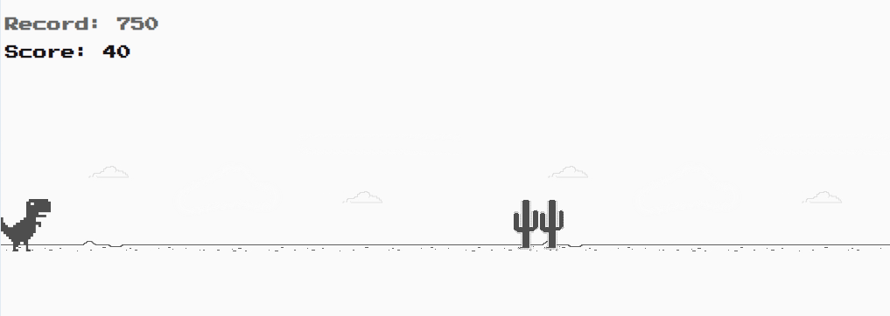

 

## dino-game

> Projeto desenvolvido durante o curso **Recriando o famoso jogo do dinossauro sem internet** da [Digital Innovation One.](https://digitalinnovation.one/)  
> Ao longo do curso foram desenvolvidas as funcionalidades básicas do jogo, como o pulo do dinossauro, movimentação do background e criação e movimentação dos obstáculos. 
> Após a conclusão do curso, diversas características foram adicionados ao jogo, como:
> - Nível de dificuldade: Há 5 níveis de velocidade dos obstáculos, que aumentam gradativamente a cada 30 segundos
> - Painel de pontuação e registro de recorde: O recorde é salvo no navegador por meio do localStorage
> - Game Over: Interrupção do jogo em caso de derrota, com mensagem de GAME OVER e opção de reinicialização do jogo
> - Ajuste no posicionamento dos elementos em tela

## 🕹️ Jogar

Para jogar basta clicar [neste link](https://gustavogod.github.io/dino-game/). Para saltar os obstáculos, pressione barra de espaço ou seta para cima.

## 🛠 Tecnologias utilizadas:

- [HTML](https://html.spec.whatwg.org/multipage/)
- [CSS](https://www.w3.org/TR/CSS/#css)
- [JavaScript](https://developer.mozilla.org/en-US/docs/Web/JavaScript)

## 🧔 Autor
 

Feito por Gustavo Oliveira Dias 👋🏽

 

## 🔑 Licença 

Este projeto está sob licença do [MIT](https://opensource.org/licenses/mit-license.php).
